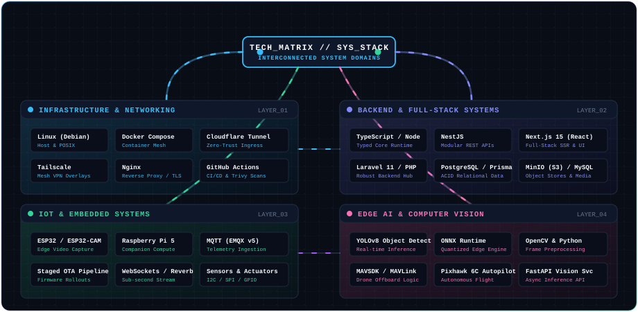
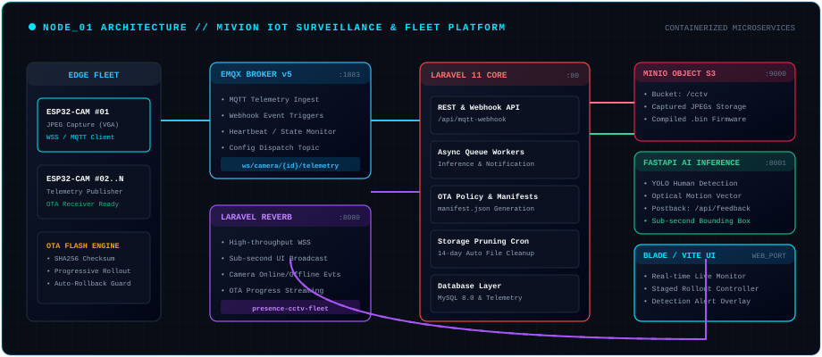
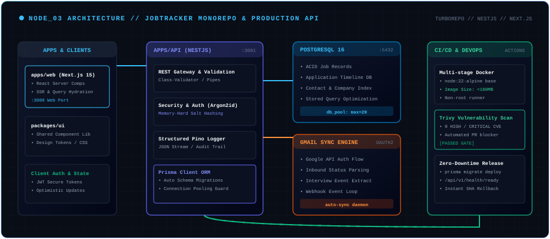
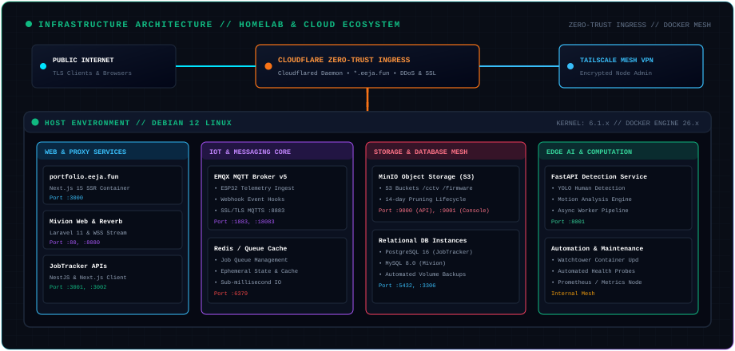

<div align="center">

<!-- ANIMATED HERO NETWORK TOPOLOGY -->


</div>

<br/>

```ini
[SESSION_INIT] .............................. OK
[SYS_CORE] .................................. ONLINE (Debian 12 / Docker Mesh)
[INGRESS_TUNNEL] ............................ CLOUDFLARE_ZERO_TRUST -> portfolio.eeja.fun
[SUBNET_NODES] .............................. CCTV_FLEET [ACTIVE] | DRONE_SYSTEM [STANDBY] | API_CLUSTER [HEALTHY]
```

---

## 🖥️ SYSTEM INITIALIZATION / WHOAMI

```bash
$ whoami
Mahija Ibad Pradipta (Eeja07)
Computer Engineering Graduate focused on building resilient, interconnected systems across
self-hosted infrastructure, IoT fleets, full-stack software, and real-time edge computer vision.

$ system --capabilities
[OK] Network & Infrastructure     -> Debian 12, Docker Compose, Cloudflare Zero-Trust, Tailscale Mesh, Nginx
[OK] IoT & Embedded Systems       -> ESP32-CAM, Raspberry Pi 5, EMQX (MQTT v5), WebSockets, Staged OTA Pipelines
[OK] Full-Stack Engineering       -> TypeScript, NestJS, Next.js 15, Laravel 11, PostgreSQL 16, MySQL, MinIO S3
[OK] Edge AI & Computer Vision    -> YOLOv8 Object Detection, ONNX Runtime (Quantized), OpenCV, MAVSDK / PX4
[OK] DevOps & Security Testing    -> Multi-Stage Minimal Alpine Builds (<180MB), Trivy CVE Scanners, CI/CD

$ network --telemetry
HOST_DOMAIN : portfolio.eeja.fun
TIMEZONE    : Asia/Jakarta (UTC+7 / WIB)
STATUS      : Open to Software Engineering, Infrastructure & IoT Systems Roles
```

---

## 🌐 ANIMATED TECHNOLOGY TOPOLOGY

<div align="center">
  
</div>

<br/>

### Matrix Breakdown

| Subsystem Domain | Core Technologies & Protocols | Architectural Role |
| :--- | :--- | :--- |
| **Infrastructure & Networking** | `Linux (Debian 12)` `Docker Compose` `Cloudflare Tunnels` `Tailscale` `Nginx` `CI/CD` | Zero-trust public ingress, containerized microservices, encrypted admin mesh VPN |
| **Backend & Full-Stack** | `TypeScript` `NestJS` `Next.js 15` `Laravel 11` `PostgreSQL 16` `Prisma` `MinIO S3` `FastAPI` | Type-safe REST APIs, Server-Side Rendering, ACID transactional data, S3 object storage |
| **IoT & Embedded Fleets** | `ESP32 / ESP32-CAM` `Raspberry Pi 5` `EMQX MQTT v5` `Laravel Reverb (WSS)` `OTA Pipelines` | Distributed edge telemetry capture, sub-second live streaming, staged firmware rollouts |
| **Edge AI & Computer Vision** | `YOLOv8` `ONNX Runtime` `OpenCV` `MAVSDK / MAVLink` `Pixhawk 6C (PX4)` | Low-latency edge inference (<50ms), human detection locks, autonomous offboard flight |

---

## 🛰️ FEATURED PROJECTS AS NETWORK NODES

---

### `NODE_01` — Mivion: IoT Surveillance & Fleet Management Platform

> **Decoupled microservices architecture for orchestrating, monitoring, and executing staged OTA firmware rollouts across fleets of edge camera microcontrollers.**

<div align="center">
  
</div>

#### ⚙️ Technical Highlights & Architecture
* **Decoupled Telemetry & Ingestion:** Edge `ESP32-CAM` microcontrollers publish real-time telemetry over `MQTT` to an **EMQX v5 Broker** and push raw JPEG snapshots via HTTP endpoints.
* **Bi-directional Webhook Synchronization:** EMQX connection webhooks notify the Laravel core backend of device online/offline states, triggering instant dashboard broadcasts via **Laravel Reverb (WebSockets)** without polling.
* **Automated Staged OTA Engine:** Uploads compiled `.bin` firmware artifacts to **MinIO (S3)**, calculates SHA256 integrity checksums, generates `manifest.json` policies, and distributes OTA triggers to device subsets via MQTT topics with rollback guards.
* **Edge Inference Pipeline:** Dispatches uploaded snapshot frames to an asynchronous **FastAPI Detection Service** running YOLO human and motion detection, posting spatial bounding boxes back to the dashboard.
* **Storage Lifecycle Policy:** Scheduled background cron tasks automatically prune image telemetry and physical MinIO S3 JPEG blobs older than 14 days to prevent disk exhaustion.

```text
[Stack]   Laravel 11 • EMQX v5 (MQTT) • MinIO (S3) • Laravel Reverb (WSS) • FastAPI • YOLOv8 • Docker • MySQL 8.0
[Source]  https://github.com/Eeja07/iot-surveillance-platform-web
```

---

### `NODE_02` — Autonomous Human Search System using Drone

> **Autonomous quadcopter search-and-rescue platform pairing Pixhawk 6C flight autopilot with an onboard Raspberry Pi 5 companion computer executing edge YOLOv8 vision and offboard MAVSDK control.**

<div align="center">
  
</div>

#### ⚙️ Technical Highlights & Architecture
* **Hardware & Airframe Stack:** Built on a Holybro S500 quadcopter airframe, Pixhawk 6C flight controller running PX4 autopilot, and a Raspberry Pi 5 companion computer communicating over high-baud UART via MAVLink.
* **Low-Latency Edge AI Pipeline:** Camera frames captured via OpenCV are processed directly on the Pi 5 using a quantized **YOLOv8n ONNX Runtime engine (320x320)**, achieving sub-50ms inference latency without external cloud dependency.
* **Autonomous Offboard Logic:** Custom Python control engine using **MAVSDK** executes systematic search sweeps, calculates target spatial offsets from bounding boxes, and commands precise autonomous tracking.
* **Telemetry & Video Downlink:** Built-in Flask telemetry server streams processed MJPEG feeds with detection overlays back to the Ground Control Station over long-range radio / Wi-Fi links.

```text
[Stack]   Python • MAVSDK • PX4 Autopilot • Pixhawk 6C • Raspberry Pi 5 • YOLOv8 • ONNX Runtime • OpenCV • Flask
[Source]  https://github.com/Eeja07/autonomus-human-search-system-using-drone-final-project-program
```

---

### `NODE_03` — JobTracker Monorepo & Production API Platform

> **Enterprise-ready job application tracking platform structured as a Turborepo monorepo with NestJS REST APIs, Next.js 15 frontend, and strict automated security CI quality gates.**

<div align="center">
  
</div>

#### ⚙️ Technical Highlights & Architecture
* **Turborepo Monorepo Architecture:** Modular workspaces cleanly separating `apps/api` (NestJS REST API), `apps/web` (Next.js 15 client), and `packages/ui` (shared design tokens and components).
* **Enterprise Security & Reliability:** Passwords protected via memory-hard **Argon2id** hashing, structured JSON logging powered by **Pino**, and transactional integrity ensured by **Prisma Client & PostgreSQL 16**.
* **Strict CI Quality Gates:** Automated GitHub Actions pipeline executing frozen lockfile installs, Prisma client generation, ESLint validation, TypeScript `tsc --noEmit` typechecks, and 100% unit test coverage gates.
* **Hardened Multi-Stage Docker Builds:** Containerized using multi-stage `node:22-alpine` builds producing minimal production images (<180MB) scanned on every build for `HIGH`/`CRITICAL` CVEs using **Trivy**.

```text
[Stack]   NestJS • Next.js 15 • PostgreSQL • Prisma ORM • Turborepo • TypeScript • Docker • Trivy • Pino • Argon2id
[Source]  https://github.com/Eeja07/job-tracker
```

---

## 🛠️ SYSTEM INCIDENTS & ENGINEERING SOLUTIONS

```ini
[INCIDENT_LOGS] Displaying verified engineering troubleshooting logs from production deployments...
```

<br/>

#### 🔴 INCIDENT #001: Half-Open WebSocket State & Socket Leaks in ESP32-CAM Fleet
* **Problem:** During intermittent Wi-Fi drops, ESP32-CAM camera clients remained apparently connected in local state but stopped receiving downstream configuration messages and ceased streaming telemetry frames.
* **Root Cause:** Half-open TCP/WebSocket socket states occurred when network paths dropped without exchanging standard TCP `FIN` or `RST` packets. The microcontroller's socket handle was neither closed nor freed, exhausting the ESP32 LWIP socket pool.
* **Resolution:** 
  1. Implemented client-side application heartbeats (`PING`/`PONG`) with strict 15-second timeouts.
  2. Built a progressive reconnection state machine with exponential backoff and explicit socket handle tear-downs (`client.stop()`).
  3. Configured EMQX broker webhooks to detect unacknowledged client keep-alives and force stale connection eviction.

---

#### 🔴 INCIDENT #002: Companion Computer Pipeline Latency & Thermal Throttling
* **Problem:** Running default PyTorch YOLO models on the drone's companion computer caused frame processing latency to exceed 180ms, resulting in lagged flight trajectory commands and elevated CPU temperatures (>78°C).
* **Root Cause:** Python interpreter overhead, unquantized FP32 matrix operations, and synchronous video capture loops starved the MAVSDK offboard control loop.
* **Resolution:**
  1. Exported the YOLOv8 model to **ONNX format with INT8 quantization** and executed inference via **ONNX Runtime** utilizing ARM NEON optimizations.
  2. Decoupled video frame acquisition into a dedicated threaded circular buffer, eliminating camera I/O wait times.
  3. Reduced inference latency to **<42ms per frame**, ensuring steady 20+ FPS offboard tracking loop execution.

---

#### 🔴 INCIDENT #003: Dev/CI Monorepo PostgreSQL Connection Starvation
* **Problem:** During concurrent Jest test suite runs and Hot Module Reloading in development, the NestJS backend threw `PrismaClientInitializationError: Timed out fetching a connection from the pool`.
* **Root Cause:** Each test runner and worker process instantiated new unmanaged `PrismaClient` instances without connection pooling limits, quickly exceeding PostgreSQL's default `max_connections = 100`.
* **Resolution:**
  1. Refactored the Prisma Service into a strictly scoped NestJS singleton lifecycle hook (`onModuleInit` / `onModuleDestroy`).
  2. Configured PostgreSQL connection string pool parameters (`connection_limit=20&pool_timeout=10`).
  3. Added explicit database connection teardown hooks in test lifecycle helpers.

---

## 🏛️ SYSTEM ARCHITECTURE & HOMELAB INFRASTRUCTURE

<div align="center">
  
</div>

<br/>

### Infrastructure Layer Separation

```text
┌────────────────────────────────────────────────────────────────────────┐
│ 1. EDGE INGRESS LAYER                                                  │
│    • Cloudflare Zero-Trust Tunnel (cloudflared daemon)                 │
│    • Automatic TLS 1.3 Termination & DDoS Mitigation                   │
│    • Domain Routing: *.eeja.fun -> Local Host Ports                    │
├────────────────────────────────────────────────────────────────────────┤
│ 2. SECURE MANAGEMENT MESH                                              │
│    • Tailscale Encrypted WireGuard Mesh VPN                            │
│    • Key-based SSH access without public port exposure                 │
├────────────────────────────────────────────────────────────────────────┤
│ 3. HOST RUNTIME (Debian 12 Bookworm)                                   │
│    • Docker Compose isolated internal bridge networks                  │
│    • Automated persistent volume backups and log rotation              │
│    • Services: Next.js Portfolio | EMQX Broker | MinIO | Postgres/MySQL│
└────────────────────────────────────────────────────────────────────────┘
```

---

## 📊 SYSTEM ACTIVITY & TELEMETRY

<div align="center">


</div>

---

## 📌 REPOSITORY CURATION & PIN RECOMMENDATION

To ensure recruiters and engineering managers immediately discover your core technical proficiencies, the following repository pinning strategy is recommended:

| Rank | Repository | Specialization Demonstrated |
| :---: | :--- | :--- |
| **1** | [`Eeja07/iot-surveillance-platform-web`](https://github.com/Eeja07/iot-surveillance-platform-web) | **IoT, WebSockets, Staged OTA, MinIO S3 & Machine Learning Ingestion** |
| **2** | [`Eeja07/autonomus-human-search-system-using-drone-final-project-program`](https://github.com/Eeja07/autonomus-human-search-system-using-drone-final-project-program) | **Edge AI (YOLO / ONNX), PX4 Autopilot, MAVSDK & Autonomous Systems** |
| **3** | [`Eeja07/job-tracker`](https://github.com/Eeja07/job-tracker) | **Production NestJS Monorepo, Next.js 15, PostgreSQL & CI/CD Security** |
| **4** | [`Eeja07/mahija-portfolio`](https://github.com/Eeja07/mahija-portfolio) | **Self-Hosted Infrastructure, Debian 12, Cloudflare Tunnels & Next.js** |
| **5** | [`Eeja07/gateway-whatsapp-bot`](https://github.com/Eeja07/gateway-whatsapp-bot) | **API Gateway & Automated Notification Systems** |
| **6** | [`Eeja07/finance-tracker`](https://github.com/Eeja07/finance-tracker) | **Full-Stack Application & State Management** |

---

## 📡 NOC DIRECTORY / COMMUNICATIONS

```bash
$ connect --target mahija
[EMAIL]     -> mahijapradipta86@gmail.com
[PORTFOLIO] -> https://portfolio.eeja.fun
[GITHUB]    -> https://github.com/Eeja07
[LINKEDIN]  -> https://linkedin.com/in/mahijapradipta
[LOCATION]  -> Indonesia (GMT+7)
```

<br/>

<div align="center">
  <sub>Engineered by <b>Mahija Ibad Pradipta</b> • Connected Systems &amp; Digital Network Lab</sub>
</div>
