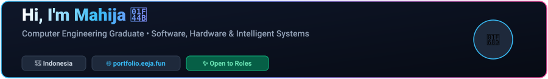
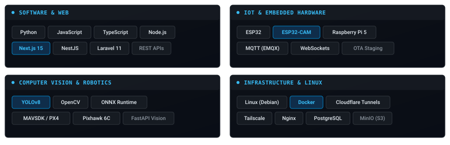
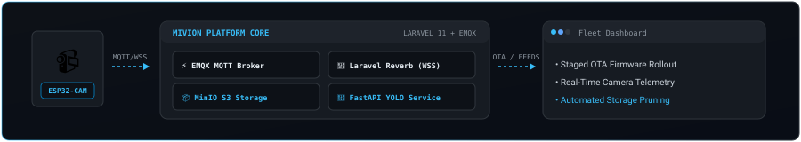
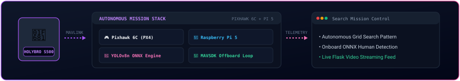
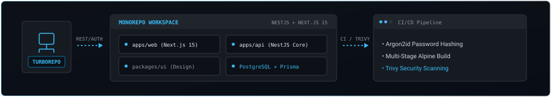

<div align="center">

<!-- 01. ANIMATED HEADER -->


<br/><br/>

<!-- 02. TYPING ANIMATION -->
<a href="https://portfolio.eeja.fun">
  
</a>

<p align="center">
  I build projects across software, IoT, infrastructure, and computer vision.
</p>

</div>

---

## 👋 About Me

I'm a **Computer Engineering graduate** interested in building practical systems across software, infrastructure, IoT, and computer vision.

I enjoy working on projects where multiple systems need to communicate and work together — from microcontroller sensor fleets and edge camera streams to full-stack web applications and on-device machine learning models.

```bash
$ whoami
Mahija Ibad Pradipta (Eeja07) • Computer Engineering Graduate
```

---

## 🛠️ Things I Work With

<div align="center">
  
</div>

<br/>

* 💻 **Software:** Python • JavaScript • TypeScript • Node.js • Next.js • NestJS • Laravel
* 🔌 **IoT & Embedded:** ESP32 • ESP32-CAM • Raspberry Pi • MQTT
* 🤖 **Computer Vision:** YOLO • OpenCV • ONNX Runtime
* 🌐 **Infrastructure:** Linux • Docker • Cloudflare • Tailscale • Nginx • PostgreSQL • MySQL

---

## 🚀 Featured Projects

---

### 📹 Mivion — IoT Surveillance & Fleet Platform

> Real-time IoT surveillance and device management platform combining ESP32-CAM devices, MQTT communication, live WebSocket feeds, staged OTA updates, and computer vision.

<div align="center">
  
</div>

* **Real-Time Telemetry & Live Feeds:** ESP32-CAM edge cameras publish telemetry over MQTT to EMQX v5, while connection webhooks notify Laravel 11 to broadcast live device states via WebSockets (Laravel Reverb).
* **Automated Staged OTA Deployments:** Uploads compiled `.bin` firmware artifacts to MinIO S3 object storage with versioned `manifest.json` metadata and SHA256 checksum validation for phased rollouts.
* **Edge Vision & Storage Lifecycle:** Dispatches uploaded snapshot frames to an asynchronous FastAPI detection service running YOLO human and motion detection, backed by automated scheduled cleanup tasks for 14-day image retention.

```text
Stack: Laravel 11 • EMQX v5 (MQTT) • MinIO (S3) • Laravel Reverb (WSS) • FastAPI • YOLOv8 • Docker • MySQL 8.0
```
👉 [View Repository →](https://github.com/Eeja07/iot-surveillance-platform-web)

---

### 🚁 Autonomous Human Search Drone

> Autonomous search-and-rescue quadcopter platform pairing a Pixhawk 6C autopilot with an onboard Raspberry Pi 5 companion computer for real-time edge vision and offboard flight control.

<div align="center">
  
</div>

* **Autopilot & Companion Integration:** Integrates a Holybro S500 quadcopter airframe and Pixhawk 6C flight controller (PX4) with a Raspberry Pi 5 communicating over high-baud UART via MAVLink.
* **On-Device Vision Pipeline:** Captures camera frames using OpenCV and executes real-time target detection onboard using ONNX Runtime with the `yolov8n320.onnx` model without cloud dependency.
* **Autonomous Offboard Flight:** Python control daemon powered by MAVSDK commands systematic search sweeps and coordinates target tracking with live video streaming via Flask.

```text
Stack: Python • MAVSDK • PX4 Autopilot • Pixhawk 6C • Raspberry Pi 5 • YOLOv8 • ONNX Runtime • OpenCV • Flask
```
👉 [View Repository →](https://github.com/Eeja07/autonomus-human-search-system-using-drone-final-project-program)

---

### 💼 JobTracker — Application Tracking Monorepo

> Job application tracking platform structured as a TypeScript monorepo with NestJS backend APIs, Next.js 15 frontend, and automated container security scans.

<div align="center">
  
</div>

* **Turborepo Workspace Architecture:** Modular monorepo cleanly isolating the NestJS REST API (`apps/api`), Next.js 15 client (`apps/web`), and shared UI component package (`packages/ui`).
* **Security & Data Layer:** Passwords protected with memory-hard Argon2id hashing, structured JSON logging via Pino, and transactional relational data managed with Prisma ORM and PostgreSQL.
* **Automated CI/CD Quality Pipeline:** GitHub Actions workflow enforcing frozen lockfile builds, typechecks (`tsc --noEmit`), automated unit tests, and multi-stage Alpine Docker builds scanned with Trivy.

```text
Stack: NestJS • Next.js 15 • PostgreSQL • Prisma ORM • Turborepo • TypeScript • Docker • Trivy • Pino • Argon2id
```
👉 [View Repository →](https://github.com/Eeja07/job-tracker)

---

## 🌱 Currently Learning

* 🏗️ **System Architecture:** Distributed systems, scalable microservices, and message-driven state management.
* 🚀 **DevOps & Deployment:** CI/CD automation, container orchestration, and reproducible deployment workflows.
* 🤖 **Computer Vision Optimization:** Model quantization, pruning, and runtime performance on embedded edge hardware.
* 🚁 **Robotics & Autonomous Systems:** ROS 2 communication patterns and sensor fusion algorithms.

---

## 📊 GitHub Activity

<div align="center">


</div>

---

## 🐍 Contribution Snake

<div align="center">
  
</div>

---

## 📫 Let's Connect

Feel free to reach out if you'd like to discuss software engineering, IoT systems, or new project collaborations!

* 🌐 **Portfolio Website:** [portfolio.eeja.fun](https://portfolio.eeja.fun)
* 💼 **LinkedIn:** [linkedin.com/in/mahijapradipta](https://linkedin.com/in/mahijapradipta)
* 📧 **Email:** [mahijapradipta86@gmail.com](mailto:mahijapradipta86@gmail.com)
* 🐙 **GitHub:** [github.com/Eeja07](https://github.com/Eeja07)

<br/>

<div align="center">
  <sub>Designed &amp; Built by <b>Mahija Ibad Pradipta</b> 👋</sub>
</div>
