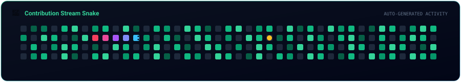

<div align="center">

<!-- 01. ANIMATED HERO -->


<br/><br/>


</div>

## 👋 About Me

I'm a **Computer Engineering graduate** passionate about building practical systems that connect software, hardware, infrastructure, and intelligent devices.

I enjoy working on end-to-end engineering projects where multiple technologies communicate smoothly — from microcontroller sensor fleets and edge camera streams to full-stack cloud APIs and real-time computer vision models.

```bash
$ whoami
Mahija Ibad Pradipta (Eeja07) • Computer Engineering Graduate
Interests: IoT Systems • Full-Stack Development • Self-Hosted Infrastructure • Edge Computer Vision
```

---

## 🛠️ Things I Work With

<div align="center">
  
</div>

<br/>

* 💻 **Software & Full-Stack:** Python • TypeScript • JavaScript • Node.js • Next.js 15 • NestJS • Laravel 11 • REST APIs
* 🔌 **IoT & Embedded Systems:** ESP32 • ESP32-CAM • Raspberry Pi 5 • MQTT (EMQX v5) • WebSockets • Staged OTA Firmware
* 🤖 **Computer Vision & Robotics:** YOLOv8 • OpenCV • ONNX Runtime • MAVSDK • Pixhawk 6C (PX4 Autopilot) • FastAPI
* 🌐 **Infrastructure & Cloud:** Linux (Debian 12) • Docker Compose • Cloudflare Tunnels • Tailscale • Nginx • PostgreSQL • MySQL • MinIO S3

---

## 🚀 Featured Projects

---

### 📹 Mivion — IoT Surveillance & Device Management Platform

> Real-time IoT surveillance and fleet management platform combining ESP32-CAM devices, MQTT messaging, live WebSocket feeds, staged OTA updates, and machine learning inference.

<div align="center">
  
</div>

* **Real-Time Telemetry & Live Feeds:** ESP32-CAM edge cameras publish telemetry over MQTT to EMQX v5, while connection webhooks notify Laravel 11 to broadcast live device states via WebSockets (Laravel Reverb).
* **Automated Staged OTA Deployments:** Uploads compiled `.bin` firmware artifacts to MinIO S3 object storage with versioned `manifest.json` metadata and SHA256 checksum validation for phased rollouts.
* **Edge Vision & Storage Lifecycle:** Dispatches uploaded snapshot frames to an asynchronous FastAPI detection service running YOLO human and motion detection, backed by automated scheduled cleanup tasks for 14-day image retention.

```text
Stack: Laravel 11 • EMQX v5 (MQTT) • MinIO (S3) • Laravel Reverb (WSS) • FastAPI • YOLOv8 • Docker • MySQL 8.0
```
👉 [View Repository →](https://github.com/Eeja07/iot-surveillance-platform-web)

---

### 🚁 Autonomous Human Search Drone System

> Autonomous search-and-rescue quadcopter platform pairing a Pixhawk 6C autopilot with an onboard Raspberry Pi 5 companion computer for real-time edge vision and offboard mission execution.

<div align="center">
  
</div>

* **Autopilot & Companion Integration:** Integrates a Holybro S500 quadcopter airframe and Pixhawk 6C flight controller (PX4) with a Raspberry Pi 5 communicating over high-baud UART via MAVLink.
* **On-Device Vision Pipeline:** Captures camera frames using OpenCV and executes real-time target detection onboard using ONNX Runtime with the `yolov8n320.onnx` model without cloud dependency.
* **Autonomous Offboard Control:** Python control daemon powered by MAVSDK commands systematic search sweeps and coordinates target tracking with live video streaming via Flask.

```text
Stack: Python • MAVSDK • PX4 Autopilot • Pixhawk 6C • Raspberry Pi 5 • YOLOv8 • ONNX Runtime • OpenCV • Flask
```
👉 [View Repository →](https://github.com/Eeja07/autonomus-human-search-system-using-drone-final-project-program)

---

### 💼 JobTracker — Application Tracking Monorepo

> Job application tracking platform structured as a TypeScript monorepo with NestJS backend APIs, Next.js 15 frontend, and automated container security scans.

<div align="center">
  
</div>

* **Turborepo Workspace Architecture:** Modular monorepo cleanly isolating the NestJS REST API (`apps/api`), Next.js 15 client (`apps/web`), and shared UI component package (`packages/ui`).
* **Security & Data Layer:** Passwords protected with memory-hard Argon2id hashing, structured JSON logging via Pino, and transactional relational data managed with Prisma ORM and PostgreSQL.
* **Automated CI/CD Quality Pipeline:** GitHub Actions workflow enforcing frozen lockfile builds, typechecks (`tsc --noEmit`), automated unit tests, and multi-stage Alpine Docker builds scanned with Trivy.

```text
Stack: NestJS • Next.js 15 • PostgreSQL • Prisma ORM • Turborepo • TypeScript • Docker • Trivy • Pino • Argon2id
```
👉 [View Repository →](https://github.com/Eeja07/job-tracker)

---

## 🌱 Currently Exploring

Here are a few technical areas and topics I'm currently exploring and actively practicing:

* 🏗️ **Distributed Systems & Event Streams:** Deepening patterns in event-driven microservices, message queues, and resilient distributed state.
* 🚀 **DevOps & Cloud-Native Tools:** Experimenting with automated CI/CD deployment pipelines, container orchestration, and self-hosted monitoring.
* 🤖 **Edge AI Acceleration:** Exploring model quantization and runtime optimizations for low-power ARM and embedded accelerators.
* 🚁 **Autonomous Robotics & Navigation:** Investigating ROS 2 communication nodes and sensor fusion algorithms for autonomous aerial platforms.

---

## 📊 GitHub Activity

<div align="center">


<br/><br/>

<!-- 🐍 CONTRIBUTION SNAKE -->


</div>

---

## 📫 Let's Connect

Feel free to reach out if you'd like to chat about software engineering, IoT, infrastructure, or exciting collaboration opportunities!

* 🌐 **Portfolio Website:** [portfolio.eeja.fun](https://portfolio.eeja.fun)
* 💼 **LinkedIn:** [linkedin.com/in/mahijapradipta](https://linkedin.com/in/mahijapradipta)
* 📧 **Email:** [mahijapradipta86@gmail.com](mailto:mahijapradipta86@gmail.com)
* 🐙 **GitHub:** [github.com/Eeja07](https://github.com/Eeja07)

<br/>

<div align="center">
  <sub>Designed &amp; Built by <b>Mahija Ibad Pradipta</b> 👋</sub>
</div>
